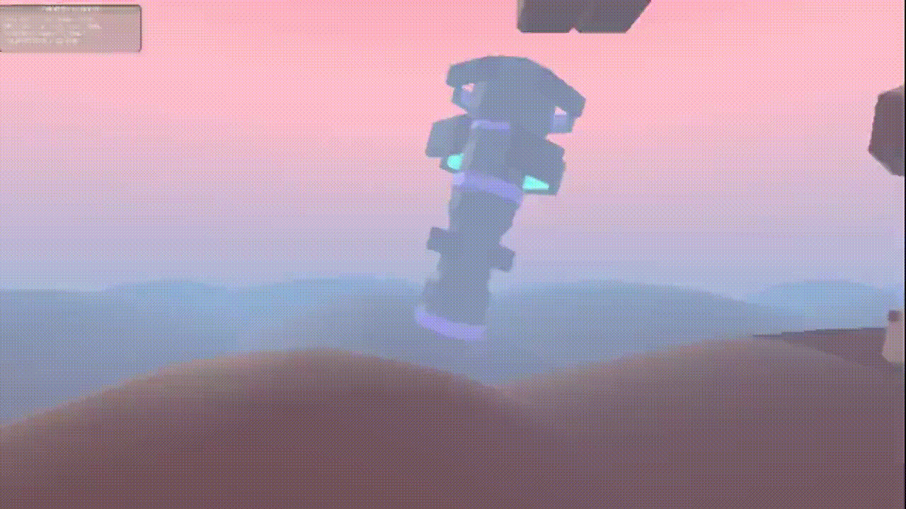

# This is a preview of some of the projects that i'm making

## A game that is reactive to the music playing

door opens to the beat  

platforms react to beat  
  

debugging fmod implementation inside unity  

object containing shader that is reactive to specific music tracks  

## Mobile game game with RPG elements

not much to preview, project scope became to big to pull off solo  

## Other stuff

health bar in a roguelike game  

gameplay  

## More coming soon
